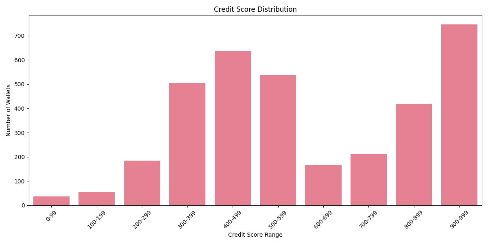

# Credit Score Analysis

## Score Distribution

## Top Performing Wallets
These wallets exhibit responsible borrowing behavior with high deposit-to-borrow ratios:
| wallet                                     |   tx_count |   deposit_count |   borrow_count |   repay_count |   redeem_count |   liquidation_count |   activity_duration_days |   total_usd_value |   avg_usd_value |   max_usd_value |   deposit_value |   borrow_value |   repay_value |   borrow_repay_ratio |   deposit_borrow_ratio |   asset_diversity |   avg_time_between_txs_hours |   time_std_hours | first_tx            | last_tx             |   tx_frequency |   health_ratio |   repay_ratio |   behavior_score |   credit_score | score_range   |
|:-------------------------------------------|-----------:|----------------:|---------------:|--------------:|---------------:|--------------------:|-------------------------:|------------------:|----------------:|----------------:|----------------:|---------------:|--------------:|---------------------:|-----------------------:|------------------:|-----------------------------:|-----------------:|:--------------------|:--------------------|---------------:|---------------:|--------------:|-----------------:|---------------:|:--------------|
| 0x01c4905e81eb6ebb919a802215b465137d1ba3a6 |          1 |               1 |              0 |             0 |              0 |                   0 |                        0 |           1.55778 |         1.55778 |         1.55778 |     1.00108e+18 |              0 |             0 |                    1 |                     10 |                 1 |                            0 |                0 | 2021-07-17 10:04:24 | 2021-07-17 10:04:24 |       0.693147 |        27.6321 |      0.693147 |          11.5301 |           1000 | nan           |
| 0x0002761e848b24046a53d494847b11a3e1d36b09 |          1 |               1 |              0 |             0 |              0 |                   0 |                        0 |           1.55779 |         1.55779 |         1.55779 |     1.00226e+18 |              0 |             0 |                    1 |                     10 |                 1 |                            0 |                0 | 2021-07-17 07:02:53 | 2021-07-17 07:02:53 |       0.693147 |        27.6333 |      0.693147 |          11.5306 |            999 | 900-999       |
| 0x0030de8f624d2b2513c6dbbff788bb109b80304d |          1 |               1 |              0 |             0 |              0 |                   0 |                        0 |           1.55779 |         1.55779 |         1.55779 |     1.00316e+18 |              0 |             0 |                    1 |                     10 |                 1 |                            0 |                0 | 2021-07-18 09:54:24 | 2021-07-18 09:54:24 |       0.693147 |        27.6342 |      0.693147 |          11.5309 |            999 | 900-999       |
| 0x00c4fd7e8e4a9680b9db58640c76d4a17bd09ee4 |          1 |               1 |              0 |             0 |              0 |                   0 |                        0 |           1.5577  |         1.5577  |         1.5577  |     9.85308e+17 |              0 |             0 |                    1 |                     10 |                 1 |                            0 |                0 | 2021-07-16 13:50:16 | 2021-07-16 13:50:16 |       0.693147 |        27.6162 |      0.693147 |          11.5237 |            999 | 900-999       |
| 0x00d88be14e08e06865b156bb489e020a59cb68fe |          1 |               1 |              0 |             0 |              0 |                   0 |                        0 |           1.55773 |         1.55773 |         1.55773 |     9.91183e+17 |              0 |             0 |                    1 |                     10 |                 1 |                            0 |                0 | 2021-07-18 02:29:29 | 2021-07-18 02:29:29 |       0.693147 |        27.6222 |      0.693147 |          11.5261 |            999 | 900-999       |

## Risky Wallets
These wallets show signs of risky behavior like high borrowing with low repayment:
| wallet                                     |   tx_count |   deposit_count |   borrow_count |   repay_count |   redeem_count |   liquidation_count |   activity_duration_days |   total_usd_value |   avg_usd_value |   max_usd_value |   deposit_value |     borrow_value |   repay_value |   borrow_repay_ratio |   deposit_borrow_ratio |   asset_diversity |   avg_time_between_txs_hours |   time_std_hours | first_tx            | last_tx             |   tx_frequency |   health_ratio |   repay_ratio |   behavior_score |   credit_score | score_range   |
|:-------------------------------------------|-----------:|----------------:|---------------:|--------------:|---------------:|--------------------:|-------------------------:|------------------:|----------------:|----------------:|----------------:|-----------------:|--------------:|---------------------:|-----------------------:|------------------:|-----------------------------:|-----------------:|:--------------------|:--------------------|---------------:|---------------:|--------------:|-----------------:|---------------:|:--------------|
| 0x003be39433bde975b12411fbc3025d49d813a84f |          4 |               0 |              1 |             0 |              0 |                   3 |                 32.3813  |           1.30139 |         1.27367 |         1.30139 |     0           | 732132           |   0           |          0           |                0       |                 2 |                    259.05    |         224.409  | 2021-06-18 06:58:58 | 2021-07-20 16:07:58 |       0.116474 |       0.455729 |   1.36587e-06 |         0.432153 |              0 | 0-99          |
| 0x00d5201c4def4d1a199c63e07eac53f43252a0ea |         17 |               5 |              7 |             1 |              0 |                   4 |                 70.632   |           1.5871  |         1.57482 |         1.58176 |     3.59192e+20 |      2.69209e+20 |   8.60306e+07 |          3.19568e-13 |                1.33425 |                 5 |                    105.948   |         316.227  | 2021-05-10 18:51:57 | 2021-07-20 10:02:00 |       0.215663 |       0.847689 |   3.19568e-13 |         0.638252 |              0 | 0-99          |
| 0x01894ddf668719ae49d364e6c77d21cfa3926ac6 |          6 |               1 |              2 |             0 |              0 |                   3 |                 52.5403  |           1.55133 |         1.54185 |         1.55037 |     2.31743e+17 |      4.73593e+16 |   0           |          0           |                4.8933  |                 4 |                    252.194   |         371.573  | 2021-05-25 14:33:30 | 2021-07-17 03:31:36 |       0.108135 |       1.77382  |   2.11152e-17 |         1.01047  |              0 | 0-99          |
| 0x0230b6df83cc33bcf9c7c29ace1ae5078fe36b74 |         92 |              30 |             34 |            12 |             13 |                   3 |                  8.91016 |           1.59801 |         1.57927 |         1.59424 |     7.46861e+21 |      1.80883e+21 |   1.52384e+10 |          8.42446e-12 |                4.12897 |                 4 |                      2.34993 |          10.6965 | 2021-05-17 16:05:36 | 2021-05-26 13:56:14 |       2.42704  |       1.63491  |   8.42446e-12 |         0.954906 |              0 | 0-99          |
| 0x0256b3d533b384fd24bfef8f61491ceea5426b5e |         75 |              31 |             18 |            10 |              8 |                   8 |                 77.0661  |           1.60558 |         1.58856 |         1.59568 |     5.4383e+22  |      9.68336e+21 |   1.23529e+21 |          0.127569    |                5.61613 |                 8 |                     24.9944  |         139.05   | 2021-04-30 22:42:29 | 2021-07-17 00:17:37 |       0.679652 |       1.88951  |   0.120064    |         1.05155  |              0 | 0-99          |